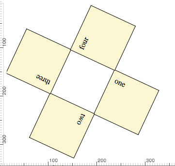
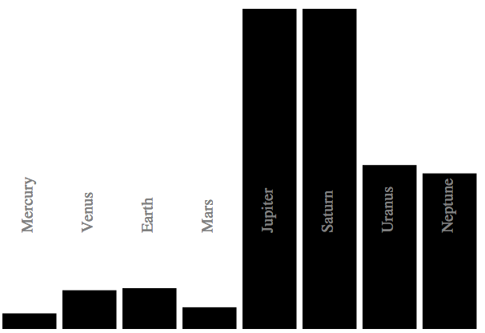

# HTML & CSS Basics Lab


## Assignment


Les trois exercices suivants sont à écrire dans le dossier `app/`. On utilisera le fichier `app/index.html` comme exemple et comme point de départ. Chaque exercice aura sa propre page HTML, ses propres fichiers JS et CSS si nécessaire.

### Exercice 1

A partir du code HTML (non modifiable) suivant :


```html
<div class="blocks">
  <div id="one">one</div>
  <div id="two">two</div>
  <div id="three">three</div>
  <div id="four">four</div>
</div>
```

écrire le code CSS (et rien d'autre que du CSS) permettant d'obtenir le résultat suivant :



### Exercice 2

A partir des données suivantes :

```
var diametres = [4878, 12104, 12756, 6787,142800,120000, 51200, 48600];
var names = ["Mercury", "Venus", "Earth", "Mars", "Jupiter", "Saturn", "Uranus", "Neptune"];
```

et en utilisant l'API native du DOM (ou jQuery) écrire le code JavaScript permettant de générer dynamiquement le DOM correspondant l'image suivante. Du CSS pourra égament être écrit si nécessaire.



### Exercice 3

Ecrire un formulaire Web permettant au commercial d'une agence immobilière de saisir toutes les informations nécéssaires à la résalisation d'une annonce immobilière. Le formulaire devra contenir les informations suivantes (liste nécessaire mais pas suffisante):
  - le titre de l'annonce
  - le prix du bien
  - date de disponibilité du bien
  - la surface du bien
  - le type de bien (appartement, maison, terrain, etc.)
  - la classe énergétique
  - des contrôles de selection permettant d'indiquer s'il y à une cave, un garage, une terrasse, un jacuzzi,  etc.
  - une zone de saisie plus grande pour pouvoir rédiger le corps de l'annonce
  - une zone permettant de glisser/déposer des images à partir de l'explorateur de fichiers (ou du bureau). Une fois déposée, chaque image est affichée sous forme de viniette. Aucun serveur ni aucune bibliothèques tierces ne sont nécéssaires pour faire cela.

Ce formulaire utilisera les standards HTML5 avec tous les nouveau types d'inputs de formulaires. Le drag'n'drop d'image se fera graâce aux standards est sans utiliser de bibliothèques tierces. On utilisera également les facilités offertes par le template CSS [Bootstrap](http://getbootstrap.com/css/#forms).

Il ne faut pas écrire la partie "serveur" de ce formulaire. Les valeurs des champs doivent être validées en utilisant encore les capasités de  HTML5.


Knowing the assignment, follow the steps below in order to complete the lab.

## Setup the Project


### Install necessary tools

**(Just do this step once for all labs)**

This project uses the [Grunt](http://gruntjs.com/) task runner to run the project. Client side dependencies are handled with the  [Bower](http://bower.io/)  package manager. Grunt and Bower have to be installed with `node` and `npm`.

1.  First install <a href="https://nodejs.org/en/download/">NodeJS</a>. You should have `node` or `nodejs` as well as `npm` in your path.  
2.  Then install Grunt and Bower:</p>
    ```sh
    npm install -g grunt-cli
    npm install -g bower
    ```

### Fork the project on github

When you **fork** a project, a copy of its repository with all the history is created for you. You become the **owner** of this **new** project and have write access to it.


### Setup the Project

Inside the Project's main folder, install its dependencies:
```sh
npm  install
bower install
```

## Run The Project

Once the project is installed, it can be run via grunt:

```sh
grunt serve
```

This will launch a Web server and open the index page of the project on your browser.


## Complete the lab - Write the project

The `app/` folder contains the `HTML` `CSS` and `JavaScript` of the application. Depending on the lab (see the "Assignment" section) you will have to write code in these parts.

## Test The Project

Unit test are kept in the `tests/` folder. The `tests/test.js` file contains all the assertions that will be tested. It is formatted with the [QUnit](https://qunitjs.com/)  testing framework. You will have to write unit tests in this file.

- Use `grunt testBrowser` to test on your browser.
- Use `grunt testCI` to test on PhantomJS, the headless browser. This will be use by the Continuous Integration system.

## Send your completed assignment

Once completed with all unit tests passing, you can send me back you assignment as a pull request. The pull request will trigger a build of the project in the Continuous Integration framework [TravisCI](https://travis-ci.org/). For this you will have to [commit](https://git-scm.com/book/en/v2/Getting-Started-About-Version-Control) your changes.

Note that you can also use Travis with your own project.
